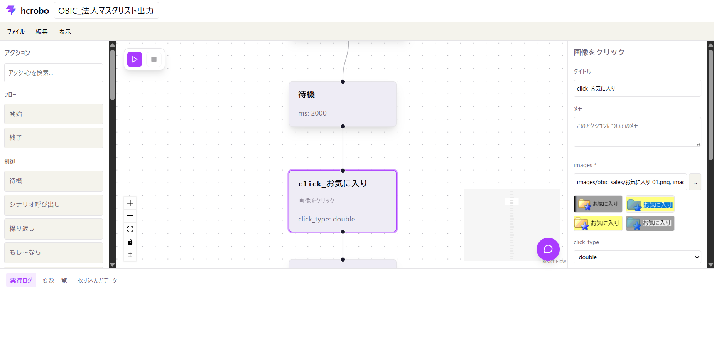

# PassoFlow


An RPA tool for Windows that searches for images on screen and performs mouse actions (move, click, double-click), as well as keyboard input, clipboard operations, window activation, app launching, file operations, and reading/writing Excel/CSV data. The sequence of operations is described in a YAML scenario file.

PassoFlow is designed as a personal, local automation tool. Its focus is the
quality of GUI automation: screen interaction, image recognition, scenario
authoring, repeatable re-execution, safety, and ease of use.

The project does not prioritize orchestration, distributed execution, cloud
operations, team management, audit systems, or deep data-workflow features.
Excel/CSV support is intended to support practical GUI scenarios, not to become
a separate data-processing platform.

The two product priorities are:

1. Make it easy to create a working GUI flow from the screen editor.
2. Make installation and first use easy enough for a personal, local setup.

The first-use path should be short: launch PassoFlow, open or create a
scenario, add actions by click or drag, configure the required values, run it,
and understand the result.

[日本語版はこちら](README_ja.md) | [CHANGELOG](CHANGELOG.md) | [SECURITY](SECURITY.md)

Licensed under [MIT](LICENSE-MIT) or [Apache-2.0](LICENSE-APACHE).

The staged Rust migration and PassoFlow-owned replacement boundary are documented in [the Rust engine boundary](docs/rust-engine.md). The shared YAML and action-result contract is summarized in [the scenario contract](docs/scenario-contract.md). The current Python runner remains the compatibility baseline until each migration phase passes its gate.

The Rust scenario contract is available to Python through the `passoflow` package (the import module is `passoflow_python`). Install the published wheel with `python -m pip install passoflow`, or run `maturin develop` from `rust/crates/passoflow-python` while developing. The binding also exposes `DomBrowser` for direct local Chromium CDP operations, `input_platform_info_json()` for read-only native desktop capability diagnostics, and `action_outcome_contract_json()` for warning policy inspection; see [`rust/crates/passoflow-python/README.md`](rust/crates/passoflow-python/README.md) for connection usage and [`examples/python_binding.py`](examples/python_binding.py) for the contract API.



## Quick start

PassoFlow is for automating a personal Windows workflow from the screen. You
do not need to edit YAML to create a scenario.

1. Install the Python dependencies with `pip install -r requirements.txt`.
2. Run `npm ci` inside `web-ui` when using a source checkout.
3. Double-click `run_webapp.bat` on Windows. It starts the services and opens the browser when ready.
4. Open an existing scenario or create a new one in the editor.
5. Click an action in the left panel, or drag it onto the canvas.
6. Fill the required values in the right panel, choose Save, and press Run.

Start with the [general user guide](http://127.0.0.1:8000/docs/manual?lang=en)
if this is your first time. Use the [advanced YAML/action
reference](http://127.0.0.1:8000/docs/manual?lang=en&audience=advanced) only when
you need direct file editing or a complete parameter reference.

## Setup

Requires Windows and Python 3.10 or later. Microsoft Excel is only required for actions that open Excel visibly or run VBA macros; the file-based Excel actions do not require Excel.

```
pip install -r requirements.txt
python -m playwright install chromium  # only needed for browser_* DOM actions
```

Copy `.env.example` to `.env` and set `ANTHROPIC_API_KEY` to enable the web UI's AI chat/suggestion/feedback features (optional — everything else works without it).

## Directory layout

| Path | Contents |
| --- | --- |
| `src/screen_actions.py` | Core functions for image search and mouse actions (move, click, double-click) |
| `src/input_actions.py` | Core functions for keyboard input, clipboard, window activation, app launching, and Excel/CSV reading/writing (no image search involved) |
| `src/overlay.py` | Always-on-top screen overlays shown while a scenario runs (window border, current-step HUD) |
| `src/run_scenario.py` | Runner that loads a YAML scenario and executes it step by step |
| `src/api_server.py` | FastAPI backend for the web UI (scenario CRUD, streamed execution, AI features) |
| `src/logging_config.py` | Logging setup (saves to file under `logs/` plus console output) |
| `src/test.py` | Manual test script for checking behavior |
| `examples/python_binding.py` | Minimal example for the Rust-backed Python binding |
| `scenarios/*.yaml` | Scenario definition files |
| `scenarios/images/<scenario name>/*.png` | Template images used by a scenario |
| `logs/` | Execution logs (gitignored) |

## Running a scenario

Create or save a scenario from the web editor, then run the resulting YAML file from the `scenarios/` directory:

```
python src\run_scenario.py scenarios\my_scenario.yaml
```

## Documentation

The [general user guide](http://127.0.0.1:8000/docs/manual?lang=en) explains the
screen and the usual click-and-run workflow. The [advanced YAML/action
reference](http://127.0.0.1:8000/docs/manual?lang=en&audience=advanced) covers
every action, parameter, variable, loop, branch, and validation rule.

## Web UI (scenario editor)

A browser-based visual editor (`web-ui/`, a React + Vite app) backed by `src/api_server.py` (FastAPI). Double-click `run_webapp.bat` on Windows: it starts the API and Vite in a source checkout, or starts only the API when `web-ui/dist` is present, then opens the browser. On macOS, double-click `run_webapp.command` when the Python backend dependencies are available, or follow the [web UI development guide](web-ui/README.md). Importing a table creates or updates an internal `load_table` runtime step that stays hidden from the canvas. The core RPA runtime remains Windows-oriented because the project includes Win32 and Excel COM actions; the macOS launcher does not make those actions cross-platform. The editor supports scenario editing, image capture/cropping, table import and preview, loops, conditional branches, undo/redo, and run logs.

Browser automation has two explicit modes: use `open_url` followed by `activate_window` and `click_image`/`type_text` to operate the visible default browser by screen image, or use `browser_navigate`, `browser_click`, `browser_fill`, and `browser_wait_for` to operate a separate Playwright-controlled browser through CSS selectors.

The Rust validator is currently opt-in. Build it with `cargo build --manifest-path rust/Cargo.toml --bin passoflow-validate`, set `PASSOFLOW_VALIDATE_BIN` to the resulting binary, and set `PASSOFLOW_USE_RUST_VALIDATOR=1` for a local runner trial. Without both settings, PassoFlow continues to use the Python validator. Use `passoflow-validate --plan <scenario.yaml>` to inspect the Rust execution plan.

To launch manually:

```
python src\api_server.py
cd web-ui && npm run dev
```

Before submitting UI changes, run `npm run build`, `npm run lint`, and `npm run test:smoke` from `web-ui/`. The smoke check validates key editor contracts without requiring an additional test runner.

The web UI includes an AI chat assistant backed by the Claude API. With an action selected, a concrete request such as “paste the 入荷番号 variable into the input” creates the required action sequence (typically `set_clipboard` followed by `paste`) and inserts it immediately after the selected node; the inserted sequence automatically makes room in the downstream layout and is undoable. The per-step "Ask AI" action in each node's right-click menu can fill in that step's parameters or switch it to a more suitable action, and (after a run with warnings) AI-generated feedback suggests how to prevent them next time. These AI features need `ANTHROPIC_API_KEY` set in `.env` (see Setup above) — the rest of the editor works without it.

## Logs

Each run creates `logs/<name>_<timestamp>.log`, recording each step's execution details and search results (matched coordinates, or a note that nothing was found), so behavior can be reviewed afterward.
